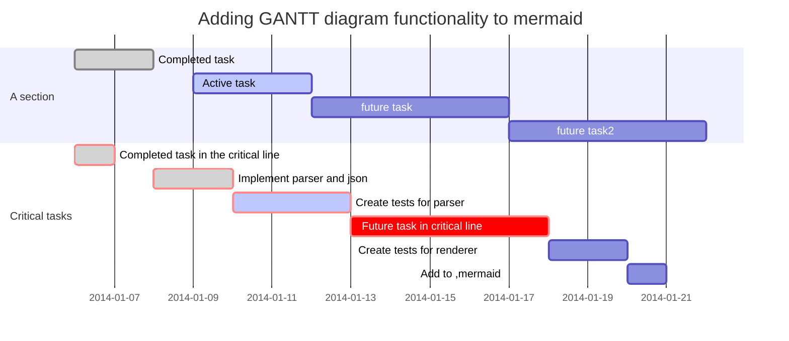

# 甘特图模板2

## 参数

    style id1 fill:#f9f,stroke:#000,stroke-width:2px,stroke-dasharray:5,5;
    fill:#f9f表示框框中填充的颜色，由RGB表示，但只有0~F，如#f00表示填充红色
    stroke:#000,表示外框的颜色，也是由RGB表示
    stroke-width:2px,表示外框短线的宽度为2个像素，
    stroke-dasharray:5,5;表示外框短线的长度，等于方框的边长除以5

## 关键词说明

    title—标题
    dateFormat—日期格式
    section—模块
    Completed—已经完成
    Active—当前正在进行
    Future—后续待处理
    crit—关键阶段

## 甘特图示例

